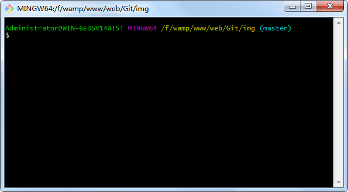
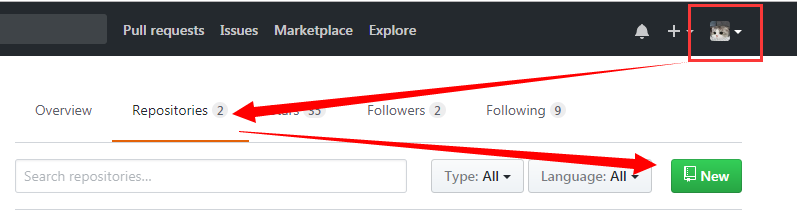
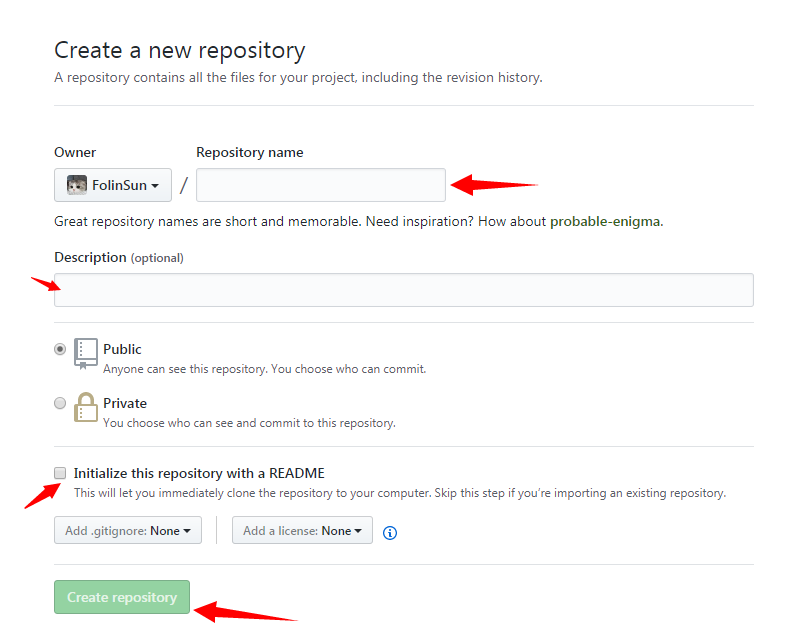

# Git
加入git有两年多的时间。最近领导要求开始团队内分享。基于团队目前还没用过git的情况下。我把之前学习git时做的笔记又重新翻出来。算是温故知新。同时也打算把笔记上传到gitHub上。毕竟能节约硬盘空间的事还是可以想一想。


# Windows上安装Git
[github下载](https://git-for-windows.github.io/) 
[国内镜像下载](https://pan.baidu.com/s/1kU5OCOB#list/path=%2Fpub%2Fgit)

全部按默认选项安装即可，安装完成后，在开始菜单里找到"Git"->"Git Bash"，蹦出一个类似命令行窗口的东西，就说明Git安装成功！



安装完成后，还需要最后一步设置，设置名字和Email地址：
````javascript
$ git config --global user.name "Your Name"
$ git config --global user.email "email@example.com"
````

备注：`git config`命令的`--global`参数，用了这个参数，表示你这台机器上所有的Git仓库都会使用这个配置，当然也可以对某个仓库指定不同的用户名和Email地址。


# 工作区和暂存区图解


# 创建版本库
#### Git初始化
- 新建一个空文件夹或者已有东西的目录也是可以的，目录名（包括父目录）不包含中文。
- 使用命令`git init`初始化一个Git仓库。
````javascript
$ git init
````

#### 添加文件到Git仓库
- 添加文件到Git仓库，分两步：
    * 使用命令`git add <file>`。告诉Git把文件添加到暂存区(Staged)。注意，此命令可反复多次使用，添加多个文件；`<file>` → 指定的某个文件。
    * 使用命令`git commit`，告诉Git把文件提交到仓库区(版本库分支master)。`-m "changes log"` → 本次提交的说明  使用完整命令`git commit -m "changes log"`
    
````javascript
$ git add [file1] [file2]        //添加指定文件到暂存区(Staged)
$ git add .                      //添加当前目录的所有文件到暂存区(Staged)
$ git add -u                     //添加修改和删除，但是不包括新建文件
$ git commit --amend -m "msg"    //修改最后一次提交
$ git commit -m "add 3 files."   //提交暂存区(Staged)到仓库区(版本库分支master)
````
    
备注：每次修改，如果不add到暂存区，那就不会加入到commit中。


# 管理修改 
- 要随时掌握工作区的状态，使用`git status`命令。
- 如果`git status`告诉你有文件被修改过，用`git diff <file>`可以查看修改内容。`<file>` → 指定的某个文件。
    * `git diff`,   查看暂存区(Staged)和工作区(本地文件)的差别。  
    * `git diff --cached` 或者 `git diff --staged` ,   查看暂存区(Staged)和当前分支最新commit之间的差别
    * `git diff HEAD`  查看工作区(本地文件)与当前分支最新commit之间的差别    
    
````javascript
$ git diff [file]           //显示暂存区和工作区的差别
$ git diff --cached [file]  //显示暂存区和当前分支最新commit的差别 → (commit 之后暂存区是空的)
$ git diff HEAD             //显示工作区与当前分支最新commit的差别
````


# 查看日志
- 穿梭前，用`git log`可以查看提交历史，以便确定要回退到哪个版本。
    * 如果嫌输出信息太多，看得眼花缭乱的，可以试试加上--pretty=oneline参数 `git log --pretty=oneline`
   
````javascript
$ git log                   //查看提交历史
$ git log --pretty=oneline  //简化版历史信息
````

---------------------------------------------------------------

> #### 场景一：在未进行git push前的所有操作，都是在"本地仓库"中执行的。如果想要进行代码还原操作，对其可以进行版本回退，撤销命令使其恢复到你想要的。 
<a name="版本回退"></a>
# 版本回退
- HEAD指向的版本就是当前版本，因此，Git允许我们在版本的历史之间穿梭，使用命令 `git reset --hard commit_id`
    * `HEAD^`   上一个版本
    * `HEAD^^ `  上上一个版本 （可一直往上叠加）
    * `HEAD~100`   往上100个版本写100个^比较容易数不过来，所以写成HEAD~100
    * `commit_id`   版本号没必要写全，一般前几位就可以了。
- 要重返未来，用`git reflog`查看命令历史，以便确定要回到未来的哪个版本。 
````javascript
$ git reset --hard HEAD           //放弃工作目录下的所有修改
$ git reset --hard [commit_id]    //将HEAD重置到指定的版本，并抛弃该版本之后的所有修改
$ git reflog                      //显示当前分支的最近几次提交
````

<a name="撤销修改"></a>
# 撤销修改
##### 如果你编写错误，可以使用命令`git checkout -- <file>` 放弃某个文件的所有本地修改，这里有两种情况：
- 一种是当前文件自修改后还没有被放到暂存区，现在撤销修改，就回到和版本库一模一样的状态。
- 一种是当前文件已经添加到暂存区后，又作了修改，现在撤销修改，就回到添加到暂存区后的状态。

总结：总之，就是让这个文件回到最近一次`git commit`或`git add`时的状态。
备注：`git checkout -- <file>`命令中的`--`很重要，没有`--`，就变成了“切换到另一个分支”的命令。

##### 如果你编写错误，还`git add`到暂存区了，可以使用命令`git reset HEAD <file>`可以把暂存区的修改撤销掉（unstage），重新放回工作区
- `git reset HEAD <file>`命令既可以回退版本，也可以把暂存区的修改回退到工作区。当我们用HEAD时，表示重置到最新的版本。

##### 小结时间：
- 场景1：当你改乱了工作区某个文件的内容，想直接丢弃工作区的修改时，用命令`git checkout -- <file>`
- 场景2：当你不但改乱了工作区某个文件的内容，还添加到了暂存区时，想丢弃修改，分两步，第一步用命令`git reset HEAD <file>`，就回到了场景1，第二步按场景1操作。
- 场景3：已经提交了不合适的修改到版本库时，想要撤销本次提交，参考 [版本回退](#版本回退)一节，不过前提还是没有推送到远程库。  

---------------------------------------------------------------
> #### 场景二：刚线上更新的代码出现问题了，需要还原这次提交的代码！或者突然发现之前的某次提交有问题了，现在想要干掉它！那么我们就需要进行远程仓库的代码回滚 
> #### 注意：对远程仓库做回滚操作是有风险的，需提前做好备份和通知其他团队成员！

# git如何回滚远程仓库
##### 通常回滚远程仓库会有以下三种情形：
- 1、删除最后一次提交，这种情况是最简单的了，只需要以下两步就可以了。
````javascript
$ git revert HEAD
$ git push origin master
````

##### 注意：revert和reset的区别，revert是放弃指定提交的修改，但是会生成一次新的提交，需要填写提交注释，以前的历史记录都在，而reset是指将HEAD指针指到指定提交，历史记录中不会出现放弃的提交记录。
* 如果删除远程仓库最后一次提交的时候不需要保留历史记录的话，你可以使用reset，命令如下：
````javascript
$ git reset --hard HEAD^
$ git push origin master -f
````

> * 备注：-f 参数是强制提交，因为reset之后本地库落后于远程库一个版本，因此需要强制提交。

- 2、删除历史某次提交，这种情况需要先用git log命令在历史记录中查找到想要删除的某次提交的commit_id，然后执行命令`git rebase -i "commit id"^`，需要注意最后的`^`号，意思是commit_id的前一次提交，执行该条命令之后会打开一个编辑框，它列出了包含该次提交在内之后的所有提交。然后在编辑框中删除你想要删除的提交所在行，然后保存退出就好啦，如果有冲突的需要解决冲突。接下来执行命令`git push origin master -f`，将本地仓库提交到远程库就完成了。
````javascript
$ git log
$ git rebase -i "commit_id"^
$ git push origin master -f
````

- 3、修改历史某次提交，这种情况的解决方法类似于第二种情况，只需要在第二条打开编辑框之后，将你想要修改的提交所在行的`pick`替换成`edit`然后保存退出，这个时候`rebase`会停在你要修改的提交，然后做你需要的修改，修改完毕之后，执行以下命令:
````javascript
$ git add .
$ git commit --amend
$ git rebase --continue
````

> * 如果你在之前的编辑框修改了n行，也就是说要对n次提交做修改，则需要重复执行以上步骤n次。
> * 同时需要注意的是，在执行rebase命令对指定提交修改或删除之后，该次提交之后的所有提交的"commit_id"都会改变。

# 删除文件
##### 假如你在文件管理器中把没用的文件删了，现在你有两个选择：
- 一是确实要从版本库中删除该文件，那就用命令`git rm <file>`删掉，并且提交到版本库，那么现在，文件就从版本库中被删除了。
- 另一种情况是误删了，但还没来得及执行`git rm <file>`命令，那就执行`git checkout -- <file>`可以把版本库的东西重新写回工作区。
- 但是如果你已经执行`git rm <file>`命令了，这时候执行`git status`会看到"Changes to be committed"，代表就连工作区的该文件也删除了。这个命令相当于同时执行了`删除文件`(1)，`git add <file>`(2)两个命令。如果想恢复该文件，可以参考[撤销修改](#撤销修改)一节。

# 添加远程仓库
<a name="新增仓库"></a>
##### 现在的情景是，你已经在本地创建了一个Git仓库后，又想在GitHub创建一个Git仓库，并且让这两个仓库进行远程同步，这样，GitHub上的仓库既可以作为备份，又可以让其他人通过该仓库来协作，真是一举多得。
- 登录进你的GitHub，然后找到"New"按钮，创建一个新的仓库。

- 根据你的项目进行相对应的填写。勾选是否要初始化README文件。最后点击"Create repository"按钮确定，就成功地创建了一个新的Git远程仓库。


##### 目前这个远程仓库还是空的。GitHub告诉我们，可以从这个仓库克隆出新的仓库，也可以把一个已有的本地仓库与之关联，然后，把本地仓库的内容推送到GitHub仓库。根据提示使用命令`git remote add [shortname] [url]`关联远程仓库。添加后，远程库的名字就是origin，这是Git默认的叫法，也可以改成别的，但是origin这个名字一看就知道是远程库。
````javascript
$ git remote add origin https://github.com/xxx/xxx                // HTTPS
$ git remote add origin git@server-name:<path/repo-name.git>      // SSH 
````
备注：有关https跟ssh提交的区别可[查看链接](https://help.github.com/articles/which-remote-url-should-i-use/);

##### 关联后，使用命令`git push`把本地库的内容推送到远程，实际上是把当前分支master推送到远程。
````javascript
$ git push -u origin master 
````
备注：由于远程库是空的，我们第一次推送master分支时，加上了`-u`参数，Git不但会把本地master分支内容推送到远程新master分支，还会把本地master分支和远程master分支关联起来，在以后的推送或者拉取时就可以直接简化命令。


# 克隆远程仓库
##### 如果我们没有本地Git库，一切从零开始，那么最好的方式是先创建远程库，然后，从远程库克隆。新增仓库步骤跟添加远程仓库[新增仓库](#新增仓库)一样。
##### 根据提示使用命令`git clone [url]`从远程库下载一个项目和它的整个历史代码到本地仓库。
````javascript
$ git clone git@server-name:<path/repo-name.git>    //SSH
$ git clone https://github.com/xxx/xxx              // HTTPS
````
备注：该命令会在本地主机生成一个目录，与远程主机的版本库同名。如果要指定不同的目录名，可以将目录名作为`git clone [url] [fileName]`命令的第二个参数。


# 分支管理
### git 的分支整体预览图如下:

##### 从上图可以看到主要包含下面几个分支：
- master： 主分支，提供给用户使用的正式版本。
- develop： 日常开发分支，该分支正常保存了开发的最新代码。
- feature： 具体的功能开发分支，从Develop分支上面分出来的。开发完成后，要再并入Develop。
- release： 预发布分支，它是指发布正式版本之前（即合并到Master分支之前），我们可能需要有一个预发布的版本进行测试。比如说某一期的功能全部开发完成，那么就将 develop 分支合并到 release 分支，测试没有问题并且到了发布日期就合并到 master 分支，进行发布。记得预发布结束以后，还需要合并进Develop分支。它的命名，可以采用release-*的形式。
- hotfix： 修补bug分支。软件正式发布以后，难免会出现bug。这时就需要创建一个分支，进行bug修补。

###### 备注：除开`master`和`develop`分支外，其他临时性分支，一般使用完，应该删除抛弃，代码库的常设分支始终只有`master`和`develop`。


##### 这里顺便推荐两个关于分支解说的文章:
###### [A successful Git branching model](http://nvie.com/posts/a-successful-git-branching-model/)
###### [Git分支管理策略](http://www.ruanyifeng.com/blog/2012/07/git.html)

### 创建与合并分支
- 使用命令`git checkout -b <name>`创建一个分支，然后切换到该分支。`git checkout`命令加上`-b`参数表示创建并切换，相当于以下两条命令：
    * `git branch <name>`
    * `git checkout <name>`  
- 使用命令`git branch`可以查看当前分支，并且会列出所有分支，当前分支前面会标一个*号。   
- 使用命令`git branch -d <name>`删除指定分支。
- 使用命令`git merge <name>`合并指定分支到当前分支。
- 如果要丢弃一个没有被合并过的分支，使用命令`git branch -D <name>`强行删除。

````javascript
$ git branch                       //查看分支
$ git branch <name>                //创建分支
$ git checkout <name>              //切换分支
$ git checkout -b <name>           //创建+切换分支
$ git merge <name>                 //合并某分支到当前分支
$ git branch -d <name>             //删除分支
$ git branch -D <name>             //强行删除分支
````

### 解决冲突    
- 当Git无法自动合并分支时，就必须首先解决冲突。解决冲突后，再提交，合并完成。
- 使用命令`git log --graph`会在各个提交之间打印出线条，这些线条可以展示出分支之间的关系。

````javascript
$ git log --graph   //可以看到分支合并图
````

### 分支管理策略
##### 通常，合并分支时，如果可能，Git会用Fast forward模式，但这种模式下，删除分支后，会丢掉分支信息。如果要强制禁用Fast forward模式，Git就会在merge时生成一个新的commit，这样，从分支历史上就可以看出分支信息。
- 合并分支时，加上`--no-ff`参数，表示禁用`fast forward`

````javascript
$ git merge --no-ff <name>
````

##### 软件开发中，bug就像家常便饭一样。有了bug就需要修复，在Git中，由于分支是如此的强大，所以，每个bug都可以通过一个新的临时分支来修复，修复后，合并分支，然后将临时分支删除。
##### 当前情景是你接到一个线上要修复的bug，但是当前正在develop上进行的工作还没有办法提交。而bug优先级又比较高，不能等待开发完成后来修复。这时候你可以使用命令`git stash`把当前工作现场"储藏"起来，然后去修复bug，修复后再使用命令`git stash pop`恢复现场继续工作。修复bug之后切记把代码合并进`develop`里。
- 使用命令`git stash`把当前工作现场"储藏"起来
- 使用命令`git stash list`查看工作现场隐藏在那个区域。
- 使用命令`git stash apply`恢复隐藏的工作现场。（但是恢复后，stash内容并不删除）。
- 使用命令`git stash apply stash@{0}`恢复指定的stash。
- 使用命令`git stash drop`来删除stash内容。
- 使用命令`git stash pop`恢复隐藏工作现场的同时把stash内容也删了。

````javascript
$ git stash
$ git stash list
$ git stash apply
$ git stash drop
$ git stash pop               
$ git stash apply stash@{0}   
````

# 多人协作
- 首先，可以试图用`git push origin <branch-name>`推送自己的修改；
- 如果推送失败，则因为远程分支比你的本地分支版本要新，需要先用`git pull`拉取最新代码并且试图合并；
- 如果合并有冲突，则解决冲突，并在本地提交；
- 没有冲突或者解决掉冲突后，再用`git push origin <branch-name>`推送就能成功！
- 如果`git pull`提示"no tracking information"，则说明本地分支和远程分支的链接关系没有创建，使用命令`git branch --set-upstream <branch-name - 本地分支> <origin/branch-name - 远程分支>`创建关联。
- 这就是多人协作的工作模式，一旦熟悉了，就非常简单。
- 小结时间：
    * 查看远程库信息，使用`git remote -v`；
    * 本地新建的分支如果不推送到远程，对其他人就是不可见的；
    * 从本地推送分支，使用`git push origin <branch-name>`，如果推送失败，先用`git pull`抓取远程的新提交；
    * 在本地创建和远程分支对应的分支，使用`git checkout -b <branch-name - 本地分支> <origin/branch-name - 远程分支>`，本地和远程分支的名称最好一致；
    * 建立本地分支和远程分支的关联，使用`git branch --set-upstream <branch-name - 本地分支> <origin/branch-name - 远程分支>`；
    * 同上`git branch --set-upstream-to <origin/branch-name - 远程分支> <branch-name - 本地分支>` , `git branch --track <branch-name - 本地分支> <origin/branch-name - 远程分支>`
    * 从远程抓取分支，使用`git pull`，如果有冲突，要先处理冲突。


# 标签管理
###### 发布一个版本时，我们通常先在版本库中打一个标签（tag），这样，就唯一确定了打标签时刻的版本。将来无论什么时候，取某个标签的版本，就是把那个打标签的时刻的历史版本取出来。所以，标签也是版本库的一个快照。所以标签的意思是：
* "我要找commit id是892b892a3f7...的那个版本"
* "一串乱七八糟的数字怎么找？"
* "我要找的commit id是打了tag 'v1.1'的那个版本"
* "找到了：git show v1.1"

### 创建标签  
- 使用命令`git tag <name>`新建一个标签，默认新建在最新提交的commit上，当然也可以指定一个commit_id。
- 使用命令`git tag`可以查看所有标签。
- 使用命令`git show <tagname>`查看标签信息。
- 使用命令`git tag -a <name> -m "txt..."`创建带有说明的标签，`-a`指定标签名，`-m`指定说明文字。

````javascript
$ git tag                    //列出所有tag
$ git tag [tag]              //新建一个tag在当前commit
$ git tag [tag] [commit]     //新建一个tag在指定commit
$ git tag -a [tag] -m "txt"  //新建一个tag在当前commit上并附加说明信息消息 
$ git show [tag]             //查看tag信息
````

### 操作标签
- 使用命令`git tag -d <tagname>`可以删除一个本地标签。
- 使用命令`git push origin <tagname>`推送某个标签到远程。
- 使用命令`git push origin --tags`一次性推送全部尚未推送到远程的本地标签。
- 如果标签已经推送到远程，要删除远程标签需先执行`git tag -d <tagname>`删除本地标签，再执行`git push origin :refs/tags/<tagname>`或者`git push origin --delete tag <tagname>`从远程删除。

````javascript
$ git tag -d <tagname>          //删除一个本地标签
$ git push origin <tagname>     //推送某个标签到远程
$ git push origin --tags        //将未推送过的本地标签全部推送到远程
$ git push origin :refs/tags/<tagname>    //比远程删除标签
$ git push origin --delete tag <tagname>  //比远程删除标签
````

# 关于GitHub总结时间 
- 在GitHub上，可以任意Fork开源仓库。
- 自己拥有Fork后的仓库的读写权限。
- 可以推送pull request给官方仓库来贡献代码。

# 自定义Git
- 使用命令`git config --global color.ui true`让Git显示颜色，会让命令输出看起来更醒目。
- 配置Git的时候，`--global`参数是全局参数，也就是这些命令在这台电脑的所有Git仓库下都有用，如果没加，那只针对当前的仓库起作用。
- 要删除配置的别名，如果是在当前仓库的话，找到`.git/config`文件，删除相对行就可以了。如果是全局的话，去用户主目录下的找到`.gitconfig`文件，删除相对行就可以了。
````javascript
$ git config --global color.ui true       //配置颜色开启
//配置别名
$ git config --global alias.st status     //st表示status
$ git config --global alias.co checkout   //co表示checkout
$ git config --global alias.ci commit     //ci表示commit
$ git config --global alias.br branch     //br表示branch
$ git config --global alias.unstage 'reset HEAD'   //unstage相当于reset HEAD
$ git config --global alias.last 'log -1'   //配置一个 git last 让其显示最后一次提交信息
$ git config --global alias.lg "log --color --graph --pretty=format:'%Cred%h%Creset -%C(yellow)%d%Creset %s %Cgreen(%cr) %C(bold blue)<%an>%Creset' --abbrev-commit"
````


# 忽略特殊文件
##### 有些时候，你必须把某些文件放到Git工作目录中，但又不能提交它们，比如保存了数据库密码的配置文件啦，等等。这个问题解决起来也很简单，在Git工作区的根目录下创建一个特殊的`.gitignore`文件，然后把要忽略的文件名填进去，Git就会自动忽略这些文件。
````javascript
# 此为注释 – 将被 Git 忽略

*.cs       # 忽略所有 .cs 结尾的文件
!ABC.cs    # 但 ABC.cs 除外
/BLL       # 仅仅忽略项目根目录下的 BLL 文件，不包括 subdir/BLL
build/     # 忽略 build/ 目录下的所有文件
doc/*.txt  # 会忽略 doc/notes.txt 但不包括 doc/server/arch.txt
````

###### 规则很简单，不做过多解释，但是有时候在项目开发过程中，突然心血来潮想把某些目录或文件加入忽略规则，按照上述方法定义后发现并未生效，原因是`.gitignore`只能忽略那些原来没有被track的文件，如果某些文件已经被纳入了版本管理中，则修改`.gitignore`是无效的。那么解决方法就是先把本地缓存删除（改变成未track状态），然后再提交：
````javascript
git rm -r --cached .
git add .
git commit -m 'update .gitignore'
````

最后推荐一个地址可以[自动生成 .gitignore 文件](https://www.gitignore.io/)