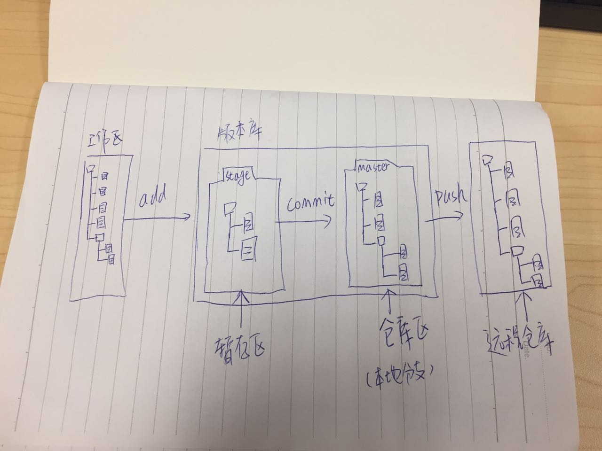

# Git
加入git有两年多的时间。最近领导要求开始团队内分享。基于团队目前还没用过git的情况下。我把之前学习git时做的笔记又重新翻出来。算是温故知新。同时也打算把笔记上传到gitHub上。毕竟能节约硬盘空间的事还是可以想一想。


# Windows上安装Git
[github下载](https://git-for-windows.github.io/) 
[国内镜像下载](https://pan.baidu.com/s/1kU5OCOB#list/path=%2Fpub%2Fgit)

全部按默认选项安装即可，安装完成后，在开始菜单里找到"Git"->"Git Bash"，蹦出一个类似命令行窗口的东西，就说明Git安装成功！


安装完成后，还需要最后一步设置，设置名字和Email地址：
````javascript
$ git config --global user.name "Your Name"
$ git config --global user.email "email@example.com"
````

备注：`git config`命令的`--global`参数，用了这个参数，表示你这台机器上所有的Git仓库都会使用这个配置，当然也可以对某个仓库指定不同的用户名和Email地址。

# 工作区和暂存区图解


# 创建版本库
### Git初始化
- 新建一个空文件夹或者已有东西的目录也是可以的，目录名（包括父目录）不包含中文。
- 使用命令`git init`初始化一个Git仓库。
````javascript
$ git init
````

### 添加文件到Git仓库
- 添加文件到Git仓库，分两步：
    * 使用命令`git add <file>`。告诉Git把文件添加到暂存区(Staged)。注意，此命令可反复多次使用，添加多个文件；`<file>` → 指定的某个文件。
    * 使用命令`git commit`，告诉Git把文件提交到仓库区(版本库分支master)。`-m "changes log"` → 本次提交的说明  使用完整命令`git commit -m "changes log"`
    
````javascript
$ git add [file1] [file2]        //添加指定文件到暂存区(Staged)
$ git add .                      //添加当前目录的所有文件到暂存区(Staged)
$ git add -u                     //添加修改和删除，但是不包括新建文件
$ git commit -m "add 3 files."   //提交暂存区(Staged)到仓库区(版本库分支master)
````
    
备注：每次修改，如果不add到暂存区，那就不会加入到commit中。

# 管理修改 
- 要随时掌握工作区的状态，使用`git status`命令。
- 如果`git status`告诉你有文件被修改过，用`git diff <file>`可以查看修改内容。`<file>` → 指定的某个文件。
    * `git diff`,   查看暂存区(Staged)和工作区(本地文件)的差别。  
    * `git diff --cached` 或者 `git diff --staged` ,   查看暂存区(Staged)和当前分支最新commit之间的差别
    * `git diff HEAD`  查看工作区(本地文件)与当前分支最新commit之间的差别    
    
````javascript
$ git diff [file]           //显示暂存区和工作区的差别
$ git diff --cached [file]  //显示暂存区和当前分支最新commit的差别 → (commit 之后暂存区是空的)
$ git diff HEAD             //显示工作区与当前分支最新commit的差别
````


# 查看日志
- 穿梭前，用`git log`可以查看提交历史，以便确定要回退到哪个版本。
    * 如果嫌输出信息太多，看得眼花缭乱的，可以试试加上--pretty=oneline参数 `git log --pretty=oneline`
   
````javascript
$ git log                   //查看提交历史
$ git log --pretty=oneline  //简化版历史信息
````
 
<a name="Git版本回退"></a>
# 版本回退
- HEAD指向的版本就是当前版本，因此，Git允许我们在版本的历史之间穿梭，使用命令 `git reset --hard commit_id`
    * `HEAD^`   上一个版本
    * `HEAD^^ `  上上一个版本 （可一直往上叠加）
    * `HEAD~100`   往上100个版本写100个^比较容易数不过来，所以写成HEAD~100
    * `commit_id`   commit_id （版本号没必要写全，前几位就可以了）
- 要重返未来，用`git reflog`查看命令历史，以便确定要回到未来的哪个版本。 
````javascript
$ git reset --hard HEAD           //放弃工作目录下的所有修改
$ git reset --hard [commit_id]    //将HEAD重置到指定的版本，并抛弃该版本之后的所有修改
$ git reflog                      //显示当前分支的最近几次提交
````

# 撤销修改
###### 如果你编写错误，可以使用命令`git checkout -- <file>` 放弃某个文件的所有本地修改，这里有两种情况：
- 一种是当前文件自修改后还没有被放到暂存区，现在撤销修改，就回到和版本库一模一样的状态。
- 一种是当前文件已经添加到暂存区后，又作了修改，现在撤销修改，就回到添加到暂存区后的状态。

总结：总之，就是让这个文件回到最近一次`git commit`或`git add`时的状态。
备注：`git checkout -- <file>`命令中的`--`很重要，没有`--`，就变成了“切换到另一个分支”的命令。

###### 如果你编写错误，还`git add`到暂存区了，可以使用命令`git reset HEAD <file>`可以把暂存区的修改撤销掉（unstage），重新放回工作区
- `git reset`命令既可以回退版本，也可以把暂存区的修改回退到工作区。当我们用HEAD时，表示最新的版本。

###### 小结时间：
- 场景1：当你改乱了工作区某个文件的内容，想直接丢弃工作区的修改时，用命令`git checkout -- <file>`
- 场景2：当你不但改乱了工作区某个文件的内容，还添加到了暂存区时，想丢弃修改，分两步，第一步用命令`git reset HEAD <file>`，就回到了场景1，第二步按场景1操作。
- 场景3：已经提交了不合适的修改到版本库时，想要撤销本次提交，参考 [Git版本回退](#Git版本回退)一节，不过前提还是没有推送到远程库。    
